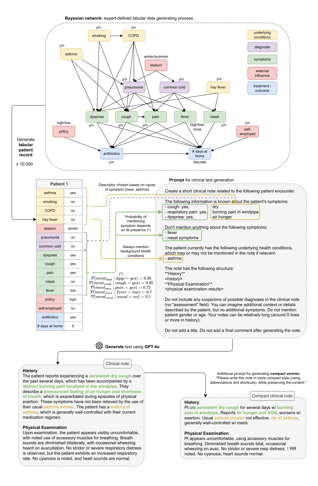

# SynSUM -- Synthetic Benchmark with Structured and Unstructured Medical Records

We present the SynSUM benchmark, a synthetic dataset linking unstructured clinical notes to structured background variables. The dataset consists of 10,000 artificial patient records containing tabular variables (like symptoms, diagnoses and underlying conditions) and related notes describing the fictional patient encounter in the domain of respiratory diseases. 

Should you use this dataset, please cite the [paper](TODO) as follows: 
```
@misc{SynSUM,
  author="Rabaey, Paloma
  and Arno, Henri
  and Heytens, Stefan
  and Demeester, Thomas",
  title="SynSUM -- Synthetic Benchmark with Structured and Unstructured Medical Records",
  year="2024",
  publisher="arXiv",
  url = {TODO}
}

```

**Data access** To access the SynSUM dataset, please download the [csv file](https://github.com/prabaey/SynSUM/blob/main/SynSUM.csv) from this repository. The dataset contains the following variables (corresponding column names are between brackets): 
- diagnoses: pneumonia (`pneu`) and common cold (`cold`)
- symptoms: dyspnea (`dysp`), cough (`cough`), pain (`pain`), fever (`fever`), nasal (`nasal`)
- underlying conditions: asthma (`asthma`), smoking (`smoking`), COPD (`COPD`), hay fever (`hay_fever`)
- external influence (non-clinical): policy (`policy`), self-employed (`self_empl`), season (`season`)
- treatment: antibiotics (`antibiotics`)
- outcome: days at home (`days_at_home`)
- text note (`text`): clinical note describing the patient encounter
- compact text note (`advanced_text`): more compact (and therefore more difficult) version of the note in `text`

**Potential use** The SynSUM dataset is primarily designed to facilitate research on clinical information extraction in the presence of tabular background variables, which can be linked through domain knowledge to concepts of interest to be extracted from the text - the symptoms, in the case of SynSUM. Secondary uses include research on the automation of clinical reasoning over both tabular data and text, causal effect estimation in the presence of tabular and/or textual confounders, and multi-modal synthetic data generation.

**Data generating process** The figure below describes the full data generating process. First, the tabular portion of the synthetic patient record is sampled from a Bayesian network, where both the structure and the conditional probability distributions were defined by an expert. Afterwards, we construct a prompt containing information on the symptoms experienced by the patient, as well as their underlying health conditions (but no diagnoses). We ask the GPT-4o large language model to generate a fictional clinical note describing this patient encounter. Finally, we ask to generate a more challenging compact version of the note, mimicking the complexity of real clinical notes by prompting the use of abbreviations and shortcuts. We generate 10.000 of these synthetic patient records in total. For the full technical report on how the data was generated, we refer to the [paper](TODO). 

<p float="center">

</p>
