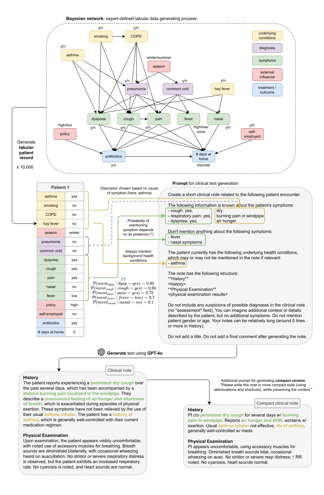

# SynSUM -- Synthetic Benchmark with Structured and Unstructured Medical Records

We present the SynSUM benchmark, a synthetic dataset linking unstructured clinical notes to structured background variables. The dataset consists of 10,000 artificial patient records containing tabular variables (like symptoms, diagnoses and underlying conditions) and related notes describing the fictional patient encounter in the domain of respiratory diseases. 

Should you use this dataset, please cite the [paper](https://arxiv.org/abs/2409.08936) as follows: 
```
@misc{SynSUM,
  author="Rabaey, Paloma
  and Arno, Henri
  and Heytens, Stefan
  and Demeester, Thomas",
  title="SynSUM -- Synthetic Benchmark with Structured and Unstructured Medical Records",
  year="2024",
  publisher="arXiv",
  url = {https://arxiv.org/abs/2409.08936}
}

```

## Summary

**Data access** To access the SynSUM dataset, please download the [csv file](https://github.com/prabaey/SynSUM/blob/main/SynSUM.csv) from this repository. The dataset contains the following variables (corresponding column names are between brackets): 
- diagnoses: pneumonia (`pneu`) and common cold (`cold`)
- symptoms: dyspnea (`dysp`), cough (`cough`), pain (`pain`), fever (`fever`), nasal (`nasal`)
- underlying conditions: asthma (`asthma`), smoking (`smoking`), COPD (`COPD`), hay fever (`hay_fever`)
- external influence (non-clinical): policy (`policy`), self-employed (`self_empl`), season (`season`)
- treatment: antibiotics (`antibiotics`)
- outcome: days at home (`days_at_home`)
- text note (`text`): clinical note describing the patient encounter
- compact text note (`advanced_text`): more compact (and therefore more difficult) version of the note in `text`

**Potential use** The SynSUM dataset is primarily designed to facilitate research on clinical information extraction in the presence of tabular background variables, which can be linked through domain knowledge to concepts of interest to be extracted from the text - the symptoms, in the case of SynSUM. Secondary uses include research on the automation of clinical reasoning over both tabular data and text, causal effect estimation in the presence of tabular and/or textual confounders, and multi-modal synthetic data generation.

**Data generating process** The figure below describes the full data generating process. First, the tabular portion of the synthetic patient record is sampled from a Bayesian network, where both the structure and the conditional probability distributions were defined by an expert. Afterwards, we construct a prompt containing information on the symptoms experienced by the patient, as well as their underlying health conditions (but no diagnoses). We ask the GPT-4o large language model to generate a fictional clinical note describing this patient encounter. Finally, we ask to generate a more challenging compact version of the note, mimicking the complexity of real clinical notes by prompting the use of abbreviations and shortcuts. We generate 10.000 of these synthetic patient records in total. For the full technical report on how the data was generated, we refer to the [paper](https://arxiv.org/abs/2409.08936). 

<p float="center">

</p>

## Additional files

`src` folder:
- `data_generating_process.py`: Contains the `RespiratoryData` class, in which the expert-defined Bayesian network is constructed. This defines the data generating process from which our tabular patient records were sampled.
- `text_generation.ipynb`: Demonstrates how text prompts are created based on the information in the tabular patient record. These prompts were fed to GPT-4o to generate the clinical text notes in our dataset.
- `symptom_predictor_baselines.ipynb`: Demonstrates how we ran some simple symptom predictor baselines on the SynSUM dataset. There are two tabular baselines (BN-tab and XGBoost-tab), one text-only neural classifier (neural-text) and one neural classifier that also sees the tabular features at the input (neural-text-tab).
- `expert_evaluation.ipynb`: Presents the results of our expert evaluation, where five experts rated the notes on several aspects, including consistency with the prompt and realism of the added context.
- `span_annotations.ipynb`: Describes our automated pipeline for annotating the clinical notes with spans pinpointing in which exact phrase(s) each symptom is mentioned in the note. 

`utils` folder: 
- `prompt_generation.py`: Helper functions for generating the text prompts from the tabular patient records.
- `bayesian_network.py`: Helper functions for learning the Bayesian network parameters from the data, used for training the BN-tab baseline.
- `neural_classifier.py`: Helper functions for learning the neural classifier weights, used for training the neural-text and neural-text-tab baselines.

`data` folder: 
- `df_synsum.p`: Pickled dataframe containing 10.000 patient records, including both tabular features and clinical text notes (the same as the [csv file](https://github.com/prabaey/SynSUM/blob/main/SynSUM.csv), but in Pandas format).
- `df_prompts.p`: Pickled dataframe containing an extended version of all patient records, including the prompts and the information that was used to construct these (mentions of symptoms, descriptors of symptoms, etc.)
- `df_train.p` and `df_test.p`: Train (8000 samples) and test (2000 samples) sets used to train and evaluate the baseline models in `symptom_predictor_baselines.ipynb`.
- `spans` folder: Span annotations of the specific phrases in which each symptom is mentioned in the notes. `normal_span_annotations.json` contains these annotations for the normal notes, while `adv_span_annotations.json` contains these for the compact advanced notes. Each of the 10.000 entries contains a list of extracted spans, where each span is made up of the following attributes: symptom ("symptom"), extracted phrase ("text") and start and end index for where this phrase can be found in the note ("start" and "end").
- `emb` folder: Train and test dataframes containing the precomputed embeddings of the ``history`` and ``physical examination`` portions of the text notes. These are used to train the neural-text and neural-text-tab baselines in `symptom_predictor_baselines.ipynb`.
- `emb/span` folder: Contains precomputed embeddings for the extracted spans. File `{sympt}_{compl}_ann_emb.npy` (e.g. "dysp_normal_ann_emb.npy") contains the average span embeddings (in order, from index 0 to 9999) for symptom "sympt" and note type "compl". 

`results` folder: Contains dataframes with the results of the symptom predictor baseline models when evaluated over the test set, for all symptoms and various settings. For more information, see the notebook `symptom_predictor_baselines`. 

`eval` folder: 
- `notes/Evaluator_{i}.csv`: CSV file containing the scores assigned by evaluator i in our expert evaluation. For more information, see the notebook `expert_evaluation.ipynb`.
- `notes/Instructions_clinical_evaluation.pdf`: File with instructions on how to conduct the clinical evaluation, which was carefully explained to each expert evaluator.
- `spans/span_eval_dataset.txt`: Random subset of 100 notes for which the automatically extracted symptom spans were manually evaluated.
- `spans/span_eval_results.csv`: Results of the manual evaluation of the extracted symptom spans. 
  
